# **¿Que es `<ESCape>`?**

Escape es nuestro escenario odoo creado para un ScapeRoom

## **Cual es nuestro objectivo?**
Crear un espacio comodo para cualquier empresa, de un modo simple y que sea facil de entender.

# **Modulos**

Para instalar cualquier modulo deseado,dentro del menu de aplicaciones, en la barra superior derecha, y buscaremos el modulo que deseemos.

Le daremos a instalar y listo, tendremos nuestro nuevo modulo instalado.

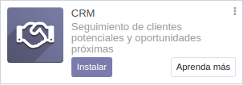

Este procedimiento se llevara a cabo con todos los modulos.

Aqui todos los que nosotros instalamos.
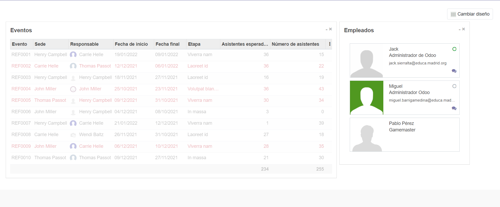
  
&nbsp;

### **Ventas**

En este modulo hemos creado nuestras 3 experiencias,como producto, para que puedan ser compradas por nuestros clientes en la pagina web. Ademas, gracias al modulo Comercio Electronico (Explicado mas adelane), tendremos todas las compras online a nuestra disposición

<!---
Aqui añadimos foto de los 3 productos
-->

&nbsp;

&nbsp;

### Facturación

&nbsp;

&nbsp;

### Sitio Web 

El modulo Sitio Web es la pagina web en la que los usuarios entran, lo explicamos aqui [Web](#Web).

&nbsp;

&nbsp;
### Eventos

&nbsp;

&nbsp;

### Empleados
gratis 
En el modulo de empleados nos hemos creado a nosotros mismos y otro empleado como ejemplo, puediendo asi diferenciar entre los distintos empleados que tengamos y poder asignar tareas a cada uno.

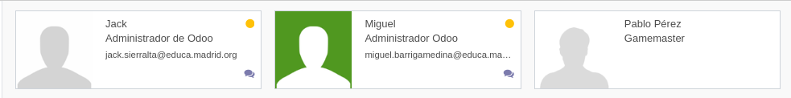

Este modulo nos proporciona poder tener los datos personales de cada empleado en caso de necesitarlos , quien es su jefe, configurar puestos de trabajo..
&nbsp;

&nbsp;

### Conversaciones

Uno de los módulos mas utiles, permite, ya sea en un chat general o chats especializados, facilitar la comunicacion entre los empleados.

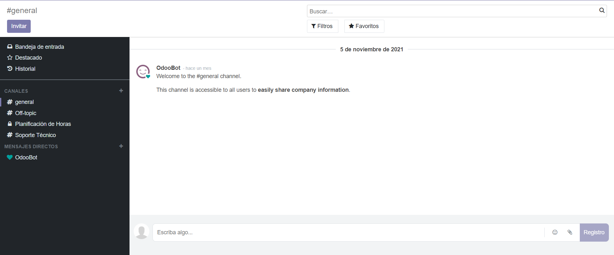

&nbsp;

&nbsp;

### Calendario

Con este modulo podremos tendremos un seguimiento de las actividades de todos nuestros empleados para mantener un buen horario de trabajo y recordatorios para proximos dias.

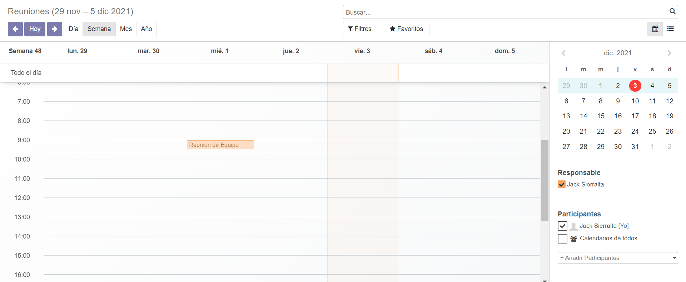

&nbsp;

&nbsp;

### Tableros

&nbsp;

&nbsp;

### Comercio Electronico

El modulo Comercio Electronico o E-commerce, nos permite tener un espacio de compra en nuestra pagina web, mandando asi la compra al modulo de ventas y poder tener un seguimineto de estas.

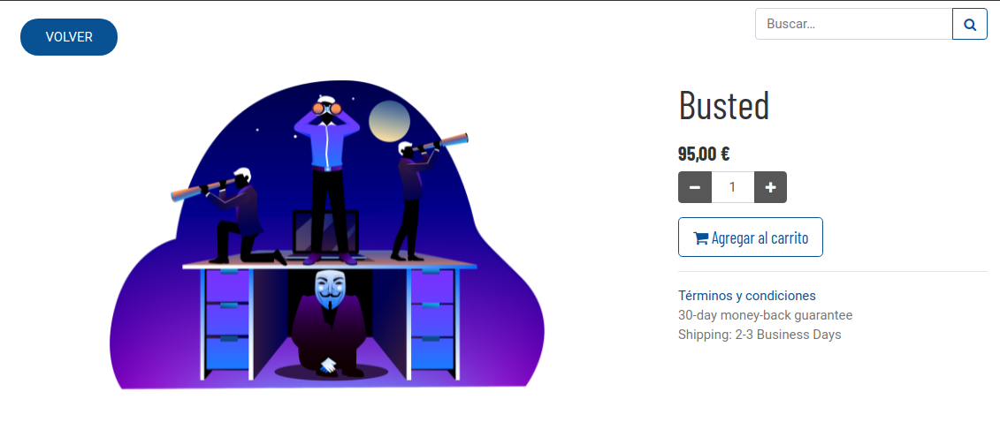

&nbsp;

Una vez un cliente realiza una compra, automaticamente la veremos en Ventas.

&nbsp;

### Contactos

Si necesitamos tener algunos contactos a mano, ya sea de empresas que nos proporcional materiales o servicios ( un proveedor, un servicio de limpieza, colaboradores..), este modulo nos permite poder tenerlos guardados, incluso con fotos!

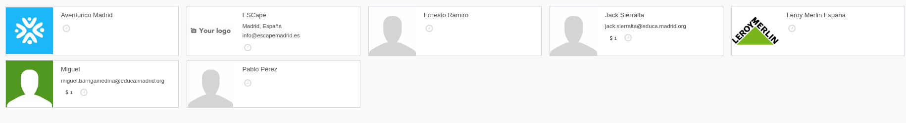
&nbsp;

&nbsp;

#  **Web**

Para la web hemos elegido el tema KEA, ya que es elegante y simple, para enfatizar en el contenido minimo y que sea de forma presencial donde se dé mas informacion.

Lo hemos hecho en 1 simple pagina, creando vinculos a la demas, pero siendo la principal la unica visible.

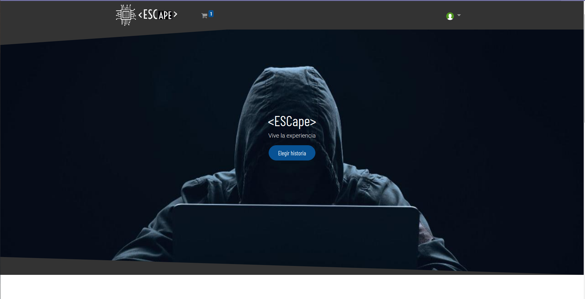

&nbsp;

Tambien se puede ver el menu de compra, por si quisieras comprar mas cosas o por si has comprado mas por error

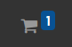

&nbsp;

Las 3 experiencias que tenemos, estaran descritas en la pagina principal, o a la hora de hacer la compra, pero nunca creando una nueva pagina.

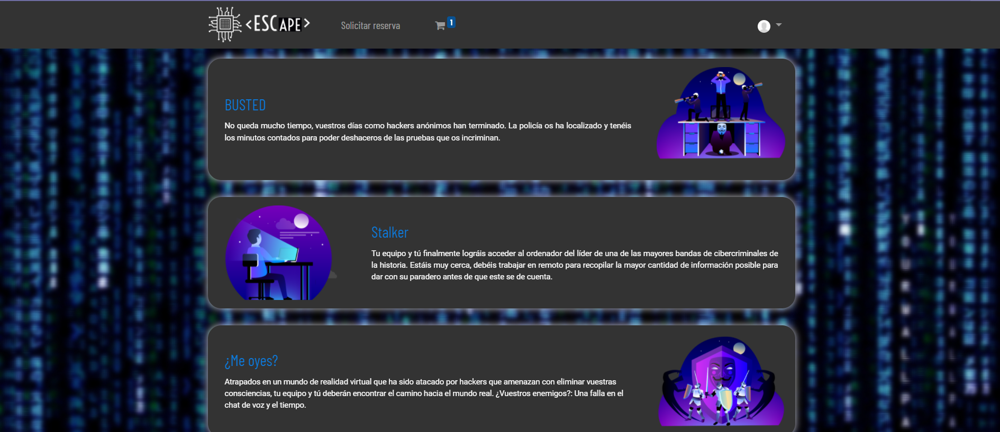

&nbsp;

Hemos elegido colores oscuros, ya que concuerdan con la tematica "hacker" o "stalker" y de color complementario, azul, el cual concuerda tambien con las imagenes elegidas.

&nbsp;

Tambien hemos implementado algun boton personalizado para hacer mas facil la navegacion entre ventanas.

&nbsp;

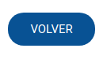

&nbsp;

<!---
Aqui añadimos la parte del server que hace Jack
-->

# Server AWS

&nbsp;

&nbsp;

# Control de versiones y seguridada del sistema.

Para tener nuestra base de datos segura y respaldada, en caso de que ocurriese un error o algun tipo de ataque informatico, podemos encriptarla y subirl a github.

Vamos a crear un backup de nuestra base de datos, y encriptarla desde la terminal de comandos de Ubuntu para que nadie pueda acceder a ella sin la cotraseña.

Primero, nos desconectamos de odoo para acceder a nuestras bases de datos.

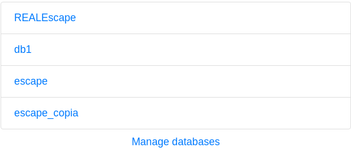

Como podeis ver, en nuestro caso, tenemos varias bases de datos distintas. Seleccionamos el menu inferior y nos saldran nuevas opciones.

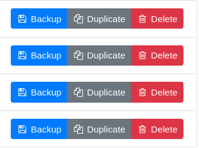

A nosotros nos interesa la opcion backup, pero tambien podremos eliminar y duplicar. Hacemos clic en ella. 

Se nos despliega un nuevo menu emergente, en el que tendremos que poner la contraseña master de odoo para poder hacer el backup y en unos momentos veremos que ya la tenemos descargada en nuestro navegador.

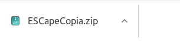

Nos dirigimos a la carpeta donde esta descargada nuestra copia y abrimos un terminal (debemos tener permisos de administrador)
Introducimos el siguiente comando:

"gpg -c [nombre de nuestro backup].zip"

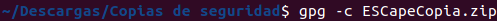

Al dar intro, nos pedira una contraseña de paso, que es la que utilizaremos para desencriptar.
Listo, ya tenemos nuestro backup de la base de datos encriptada y totalmentes segura.

Ahora, vamos a subir todo junto con odoo a nuestro Github.

