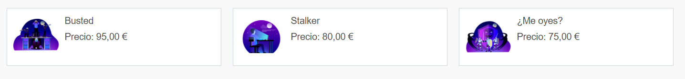
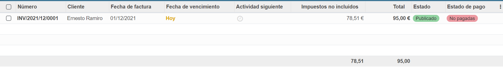
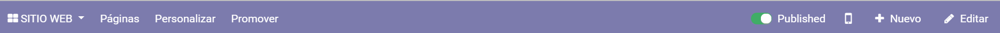
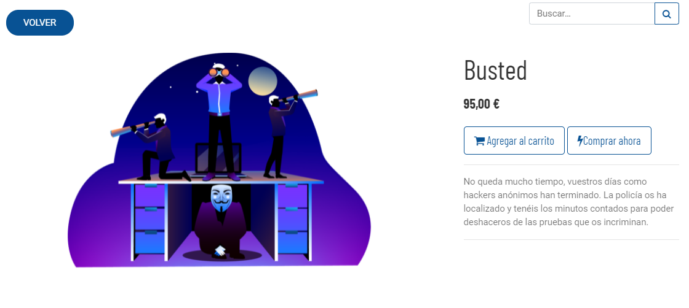
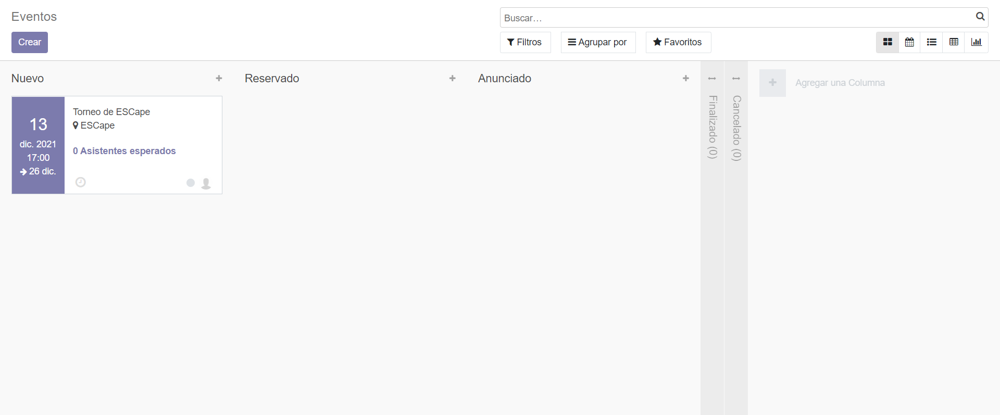

# **¿Qué es `<ESCape>`?**
`<ESCape>` es nuestro escenario Odoo creado para un local de Escape Room ficticio.
# **¿Cuál es nuestro objetivo?**
Crear un espacio cómodo para la gestión de empresas, fácil de entender para cualquier nivel de usuario.
# **Módulos**
Los módulos utilizados para este proyecto son:
- Ventas
- Facturación
- Sitio web
- Comercio electrónico
- Empleados
- Eventos 
- Conversaciones
- Contactos 
- Calendario 
- Tableros
## **Ventas**
A través de este módulo podremos gestionar todo lo relacionado con las ventas de nuestros servicios.

Hemos creado los productos de nuestras tres experiencias para que puedan ser compradas por nuestros clientes en la página web gracias al módulo Comercio Electronico (explicado mas adelante).

&nbsp;

&nbsp;

## **Facturación**
A través de este módulo podemos crear facturas para clientes y proveedores.

&nbsp;

&nbsp;

## **Sitio Web**
El módulo Sitio Web es la página web en la que los usuarios entran, a través de este módulo podemos modificar los distinto elementos de la página web así como su contenido. [Lo explicamos a detalle más abajo.](#Web)

&nbsp;

&nbsp;

## **Comercio Electrónico**
El módulo Comercio Electrónico es un submódulo de Sitio Web, nos permite publicar nuestros productos en la página para venderlos, aceptando pagos a través de diversas plataformas de pago como PayPal.

&nbsp;

&nbsp;

## **Empleados**
En el módulo Empleados se almacenan los datos de cada empleado, así como su departamento y otros datos de interés.

&nbsp;

&nbsp;

## **Eventos**
En este módulo se puede generar eventos y asignar organizadores y/o responsables. Estos eventos pueden ser solo para los empleados, o ser vendidos a través del sitio web.

&nbsp;

&nbsp;

## **Conversaciones**
El módulo Conversaciones permite crear canales de chat entre empleados y mandar mensajes directos en tiempo real. Se pueden asignar canales por departamento o tipo de empleado.

&nbsp;

&nbsp;

## **Contactos**
Este módulo funciona como una agenda de contactos. Tiene una base de datos de empresas dónde podemos cargar automáticamente toda la información de estas.

&nbsp;

&nbsp;

## **Calendario**

Este módulo permite crear una calendario en común entre los empleados o calendarios personales.

&nbsp;

&nbsp;

## **Tableros**
Los Tableros nos permiten crear espacios de trabajo con los módulos o funciones que más necesitemos

&nbsp;

&nbsp;

# <a name="web"></a> **Página Web**

*Se puede acceder a través del siguiente enlace: http://3.144.140.56:8069/*

La página web es de estilo landing page, con pocos menús y enlaces externos salvo los del módulo de Comercio Electrónico. Hemos elegido el tema KEA, ya que es elegante y simple.

&nbsp;

&nbsp;

Las tres experiencias que hemos definido como productos, están descritas en la página principal-

&nbsp;

&nbsp;

Hemos elegido colores oscuros, ya que concuerdan con la tematica "hacker" y de color complementario el azúl.

&nbsp;

&nbsp;

También hemos implementado un botón personalizado con HTML y CSS para hacer mas fácil la navegación entre ventanas.

&nbsp;

&nbsp;

# **Server AWS**
En este caso, Odoo 14 está desplegado en una instancia de Ubuntu 20.04, alojado en el servicio de AWS EC2.

# **Control de versiones y seguridad del sistema**

Para tener nuestra base de datos segura respaldada, debemos hacer una copia de seguridad frecuentemente y encriptarla para evitar problemas de seguridad.

Con el siguiente comando hacemos la copia de seguridad:

```wget --post-data 'master_pwd=CONTRASEÑA&name=NOMBREdeLAbaseDEdatos&backup_format=zip' -O ./copia.zip http://localhost:8069/web/database/backup```

Se genera un fichero **copia.zip**, que procedemos a encriptar utilizando el siguiente comando:

```gpg -c copia.zip```

Solicitará una clave de paso que debemos utilizar para desencriptar la base de datos en un futuro y se generará un fichero **copia.zip.gpg**, que será nuestra copia de seguridad encriptada.