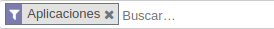
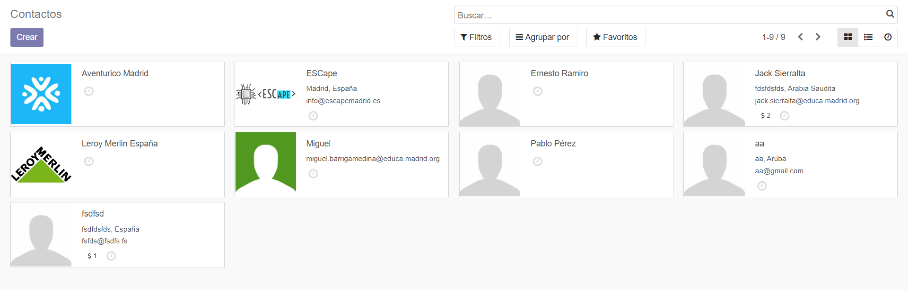

# ¿Que es `<ESCape>`?

Escape es nuestro escenario odoo creado para un ScapeRoom

## Cual es nuestro objectivo?
Crear un espacio comodo para cualquier empresa, de un modo simple y que sea facil de entender.

# Modulos

Para instalar cualquier modulo deseado,dentro del menu de aplicaciones, en la barra superior derecha, y buscaremos el modulo que deseemos.

Le daremos a instalar y listo, tendremos nuestro nuevo modulo instalado.

Este procedimiento se llevara a cabo con todos los modulos.

Aqui todos los que nosotros instalamos.

  
&nbsp;

&nbsp;

### **Ventas**

En este modulo hemos creado nuestras 3 experiencias,como producto, para que puedan ser compradas por nuestros clientes en la pagina web
<!---
Aqui añadimos foto de los 3 productos
-->

<!--Ejemplo de compra -->

&nbsp;

&nbsp;

### Facturación

&nbsp;

&nbsp;

### Sitio Web

El modulo Sitio Web es la pagina web en la que los usuarios entran, lo explicamos aqui [Web](#web).
&nbsp;

&nbsp;
### Eventos

&nbsp;

&nbsp;

### Empleados

En el modulo de empleados nos hemos creado a nosotros mismos y otro empleado como ejemplo, puediendo asi diferenciar entre los distintos empleados que tengamos y poder asignar tareas a cada uno.

Este modulo nos proporciona poder tener los datos personales de cada empleado en caso de necesitarlos , quien es su jefe, configurar puestos de trabajo..
&nbsp;

&nbsp;

### Conversaciones

Uno de los módulos mas utiles, permite, ya sea en un chat general o chats especializados, facilitar la comunicacion entre los empleados.

&nbsp;

&nbsp;

### Calendario

Con este modulo podremos tendremos un seguimiento de las actividades de todos nuestros empleados para mantener un buen horario de trabajo y recordatorios para proximos dias.

&nbsp;

&nbsp;

### Tableros

&nbsp;

&nbsp;

### Comercio Electronico

&nbsp;

&nbsp;

### Contactos

Si necesitamos tener algunos contactos a mano, ya sea de empresas que nos proporcional materiales o servicios ( un proveedor, un servicio de limpieza, colaboradores..), este modulo nos permite poder tenerlos guardados, incluso con fotos!

&nbsp;

&nbsp;

# Web 

{web}

Para la web hemos elegido el tema KEA, ya que es elegante y simple, para enfatizar en el contenido minimo y que sea de forma presencial donde se dé mas informacion.

Lo hemos hecho en 1 simple pagina, creando vinculos a la demas, pero siendo la principal la unica visible.

&nbsp;

&nbsp;

Tambien se puede ver el menu de compra, por si quisieras comprar mas cosas o por si has comprado mas por error

&nbsp;

&nbsp;

Las 3 experiencias que tenemos, estaran descritas en la pagina principal, o a la hora de hacer la compra, pero nunca creando una nueva pagina.

&nbsp;

&nbsp;

Hemos elegido colores oscuros, ya que concuerdan con la tematica "hacker" o "stalker" y de color complementario, azul, el cual concuerda tambien con las imagenes elegidas.

&nbsp;

&nbsp;

Tambien hemos implementado algun boton personalizado para hacer mas facil la navegacion entre ventanas.

&nbsp;

&nbsp;

<!---
Aqui añadimos la parte del server que hace Jack
-->

# Server AWS
