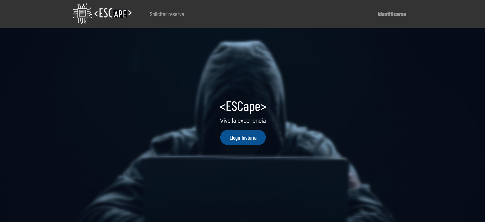

# **¿Qué es `<ESCape>`?**
`<ESCape>` es nuestro escenario Odoo creado para un local de Escape Room ficticio.

&nbsp;
# **¿Cuál es nuestro objetivo?**
Crear un espacio cómodo para la gestión de empresas, fácil de entender para cualquier nivel de usuario.

&nbsp;
# **Módulos**
Los módulos utilizados para este proyecto son:
- Ventas
- Facturación
- Sitio web
- Comercio electrónico
- Empleados
- Eventos 
- Conversaciones
- Contactos 
- Calendario 
- Tableros

&nbsp;

&nbsp;
## **Ventas**
A través de este módulo podremos gestionar todo lo relacionado con las ventas de nuestros servicios.

Hemos creado los productos de nuestras tres experiencias para que puedan ser compradas por nuestros clientes en la página web gracias al módulo Comercio Electronico (explicado mas adelante).

&nbsp;

&nbsp;
## **Facturación**
A través de este módulo podemos crear facturas para clientes y proveedores.

&nbsp;

&nbsp;
## **Sitio Web**
El módulo Sitio Web es la página web en la que los usuarios entran, a través de este módulo podemos modificar los distinto elementos de la página web así como su contenido. [Lo explicamos a detalle más abajo.](#Web)

&nbsp;

&nbsp;
## **Comercio Electrónico**
El módulo Comercio Electrónico es un submódulo de Sitio Web, nos permite publicar nuestros productos en la página para venderlos, aceptando pagos a través de diversas plataformas de pago como PayPal.

&nbsp;

&nbsp;
### Empleados
En el módulo de Empleados nos hemos creado a nosotros mismos y otros empleados como ejemplo, pudiendo así diferenciar entre los distintos empleados que tengamos y poder asignar tareas a cada uno.

Este modulo nos proporciona poder tener los datos personales de cada empleado en caso de necesitarlos, quién es su jefe, configurar puestos de trabajo...
&nbsp;

&nbsp;

### Conversaciones

Uno de los módulos mas utiles, permite, ya sea en un chat general o chats especializados, facilitar la comunicacion entre los empleados.

&nbsp;

&nbsp;

### Calendario

Con este modulo podremos tendremos un seguimiento de las actividades de todos nuestros empleados para mantener un buen horario de trabajo y recordatorios para proximos dias.

&nbsp;

&nbsp;

### Tableros

&nbsp;

&nbsp;

### Comercio Electronico

El modulo Comercio Electronico o E-commerce, nos permite tener un espacio de compra en nuestra pagina web, mandando asi la compra al modulo de ventas y poder tener un seguimineto de estas.

&nbsp;

Una vez un cliente realiza una compra, automaticamente la veremos en Ventas.

&nbsp;

### Contactos

Si necesitamos tener algunos contactos a mano, ya sea de empresas que nos proporcional materiales o servicios ( un proveedor, un servicio de limpieza, colaboradores..), este modulo nos permite poder tenerlos guardados, incluso con fotos!

&nbsp;

&nbsp;

#  **Web**

Para la web hemos elegido el tema KEA, ya que es elegante y simple, para enfatizar en el contenido minimo y que sea de forma presencial donde se dé mas informacion.

Lo hemos hecho en 1 simple pagina, creando vinculos a la demas, pero siendo la principal la unica visible.

&nbsp;

Tambien se puede ver el menu de compra, por si quisieras comprar mas cosas o por si has comprado mas por error

&nbsp;

Las 3 experiencias que tenemos, estaran descritas en la pagina principal, o a la hora de hacer la compra, pero nunca creando una nueva pagina.

&nbsp;

Hemos elegido colores oscuros, ya que concuerdan con la tematica "hacker" o "stalker" y de color complementario, azul, el cual concuerda tambien con las imagenes elegidas.

&nbsp;

Tambien hemos implementado algun boton personalizado para hacer mas facil la navegacion entre ventanas.

&nbsp;

&nbsp;

<!---
Aqui añadimos la parte del server que hace Jack
-->

# Server AWS

&nbsp;

&nbsp;

# Control de versiones y seguridada del sistema.

Para tener nuestra base de datos segura y respaldada, en caso de que ocurriese un error o algun tipo de ataque informatico, podemos encriptarla y subirl a github.

Vamos a crear un backup de nuestra base de datos, y encriptarla desde la terminal de comandos de Ubuntu para que nadie pueda acceder a ella sin la cotraseña.

Primero, nos desconectamos de odoo para acceder a nuestras bases de datos.

Como podeis ver, en nuestro caso, tenemos varias bases de datos distintas. Seleccionamos el menu inferior y nos saldran nuevas opciones.

A nosotros nos interesa la opcion backup, pero tambien podremos eliminar y duplicar. Hacemos clic en ella. 

Se nos despliega un nuevo menu emergente, en el que tendremos que poner la contraseña master de odoo para poder hacer el backup y en unos momentos veremos que ya la tenemos descargada en nuestro navegador.

Nos dirigimos a la carpeta donde esta descargada nuestra copia y abrimos un terminal (debemos tener permisos de administrador)
Introducimos el siguiente comando:

"gpg -c [nombre de nuestro backup].zip"

Al dar intro, nos pedira una contraseña de paso, que es la que utilizaremos para desencriptar.
Listo, ya tenemos nuestro backup de la base de datos encriptada y totalmentes segura.

Ahora, vamos a subir todo junto con odoo a nuestro Github.

